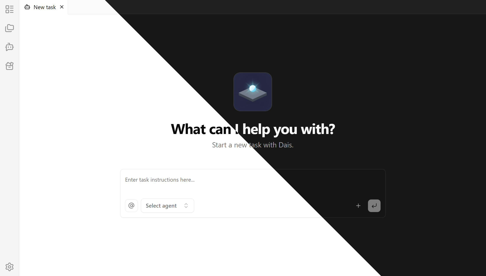

<div align="center">
    <br />
    
    <h1>Dais</h1>
    Your <b>D</b>esktop <b>AI</b> <b>S</b>taffs
    <br />
    <a href="./docs/readme/README_zh_CN.md">简体中文</a> |
    English
    <br />
    <br />
</div>

## Screenshot



## Quick Start

<p>
  <a href="https://github.com/Dais-Project/Dais/releases/latest">
    
  </a>
</p>

## Development

This project uses Nx to manage all the development commands, use `pnpm` to run the available scripts in [`package.json`](package.json).

Install dependencies (postinstall will run `nx run-many -t install` for subprojects)
```
pnpm install
```

Start the dev servers
```
pnpm run dev
```

Build all projects
```
pnpm run build
```
