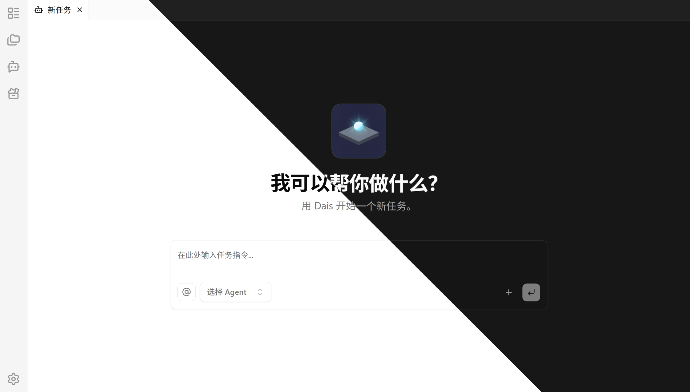

<div align="center">
    <br />
    
    <h1>Dais</h1>
    你的桌面 AI 员工
    <br />
    简体中文 |
    <a href="../../README.md">English</a>
    <br />
    <br />
</div>

## 屏幕截图



## 快速开始

<p>
  <a href="https://github.com/Dais-Project/Dais/releases/latest">
    
  </a>
</p>

## 功能特点

- 丰富的能力扩展：支持接入更多外部工具，让 Agent 能处理更丰富的任务场景
- 灵活的技能管理：支持统一管理和分配 Agent 技能，让不同任务使用合适的能力组合
- 清晰的工作区管理：支持在多个工作区之间自由切换，适配不同项目和使用场景
- 多任务并行推进：支持同时处理和管理多个任务，让多任务处理更高效
- 更安心的操作控制：通过严格的权限限制，降低 Agent 执行意外操作的风险

## 开发

本项目使用 Nx 来管理全部开发命令，使用 `pnpm` 运行 [`package.json`](package.json) 中提供的脚本。

安装依赖（postinstall 会为子项目执行 `nx run-many -t install`）
```
pnpm install
```

启动开发服务器
```
pnpm run dev
```

构建所有项目
```
pnpm run build
```
